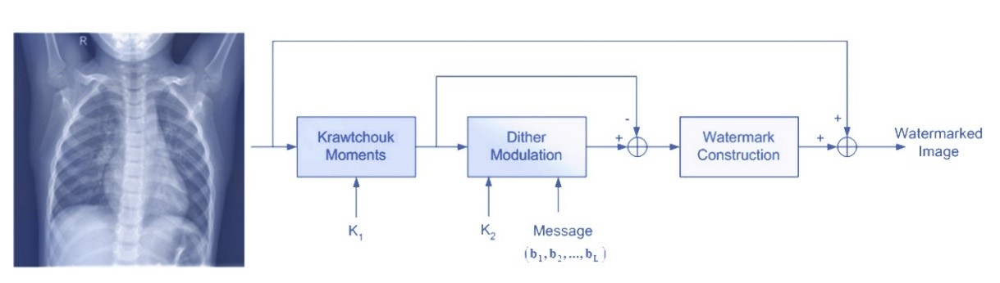

# KMsWA2
This repository contains the implementaion of Krawtchouk Moments based Watermarking Attack, a black box attack on medical images. This attack was proposed in the paper "Digital Watermarking as an Adversarial Attack on Medical Image Analysis with Deep Learning" which published in Journal of Imaging.

## Dependencies
* Python (>=3.7)
* NumPy (>= 1.20.1)
* pillow (>=8.1.0)
